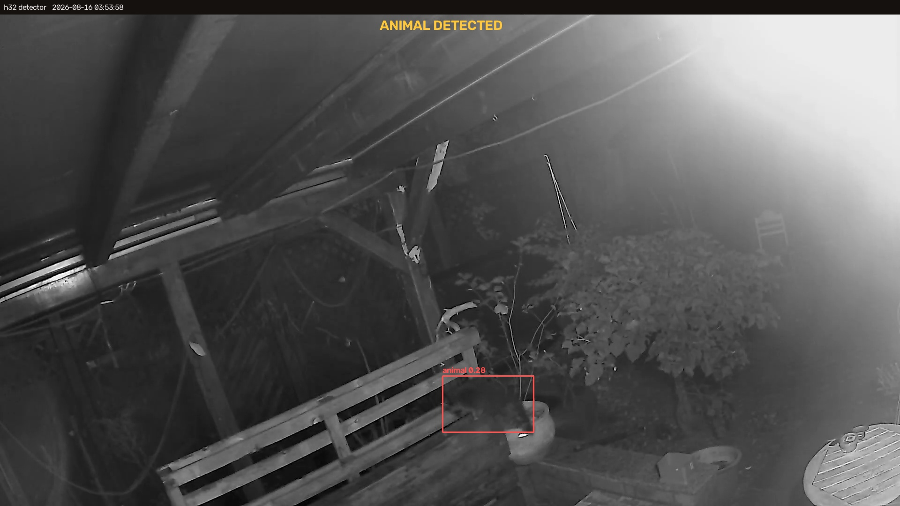

# h32 — Victure PC530 local camera viewer

I live in Berlin, and raccoons were raiding my pond — bothering the sticklebacks and the
bitterling. I wanted to see how they were breaking in.



*Caught in the act at 03:53. [Full 37s clip](detector/samples/20260816_035358_animal.mp4).*

A self-contained **local** web app for viewing (and eventually controlling) a Victure
PC530 Wi-Fi camera — no vendor cloud involved. Runs on this MacBook now; designed to
also drive a Raspberry Pi + HDMI screen later.

Type **`h32`** in a terminal → the media server starts and the viewer opens in your browser.

```
h32            start the server (if needed) and open the viewer
h32 stop       stop the media server
h32 restart    restart it
h32 status     is it running?
h32 log        follow the go2rtc log
```

Viewer: <http://127.0.0.1:1984/>

## Setup (fresh clone)

The go2rtc binary is gitignored (not stored in the repo). After cloning:

```
cp local.env.example local.env    # then edit: camera IP + password
./get-go2rtc.sh                   # download the pinned go2rtc binary
python3 -m venv .venv && ./.venv/bin/pip install scapy   # only needed for PTZ capture
```

Then `h32` (add the alias if it isn't already: `alias h32="$PWD/h32"` in `~/.zshrc`).

**`local.env` is where every site-specific value lives** — camera address, camera
password, your LAN layout, the alert e-mail address. It is gitignored, and nothing else
in the repo hardcodes any of it: `h32` exports these vars so go2rtc can expand the
`${H32_*}` placeholders in `go2rtc.yaml`, and the Python tools read the same file via
`h32env.py`. SMTP credentials are separate again, in `detector/secrets.json`.

Check what it resolved to with `./.venv/bin/python h32env.py`.

## Controls

| Action | Mouse | Keyboard |
|---|---|---|
| Enable audio | "Tap for sound" / 🔇 | `m` |
| Digital zoom | ＋ / － / wheel | `+` `-` |
| Digital pan (when zoomed) | PAN arrows | ← ↑ ↓ → |
| Reset view | ⤢ | `0` |
| Snapshot (PNG) | 📷 | `s` |
| Fullscreen | ⛶ | `f` |
| Switch 1080p / 360p | 1080p / 360p | — |
| Camera controls drawer | 🎛 | — |

## What works vs. pending

| Feature | State |
|---|---|
| Live 1080p / 360p video | ✅ working (WebRTC, sub-second; MSE fallback) |
| Listen to camera mic | ✅ working (in the stream) |
| Digital zoom + pan, snapshot, fullscreen | ✅ working (browser-side) |
| **Animal/person detector + pre-roll recorder** | ✅ working (`h32 detect`, see `detector/`) |
| **Mechanical PTZ** (pan/tilt the lens) | ⛔ parked — cloud-brokered; local replay doesn't work on this firmware (see notes) |
| **Two-way talk** | ⛔ parked — same proprietary cloud path |
| Raccoon-*specific* alert (vs any animal) | ⏳ next — needs a raccoon classifier stage |

The 🎛 drawer shows the PTZ/talk buttons disabled — parked, see notes below.

## Camera reference

- **Ports:** RTSP `:554`, ONVIF `:8080`, proprietary `:23456` / `:34567`. Address and login go in `local.env`.
- **Main stream:** `rtsp://<user>:<pass>@<camera-ip>:554/realmonitor?channel=0&stream=0.sdp` (1080p H.264 + PCM-alaw audio)
- **Sub stream:** `…&stream=1.sdp` (640×360)
- ⚠️ **ONVIF must stay enabled in the IPC360 app** — that's what opens `:554`/`:8080`. If you turn it off, video stops working here.
- ⚠️ **Change the default password.** These cameras ship as `admin` / `123456`; the IPC360 app
  can change it. The RTSP stream is unencrypted on the LAN either way, so treat the camera as a
  LAN-only device and do **not** port-forward `:554` to the internet.

## How it works

```
camera (RTSP) ──► go2rtc ──► WebRTC/MSE ──► browser (web/index.html)
                    ▲
              go2rtc.yaml
```

- `go2rtc` — single Go binary; ingests the camera RTSP and serves low-latency WebRTC. Also serves the UI (`api.static_dir`).
- `go2rtc.yaml` — stream + server config.
- `web/` — the viewer: `index.html` (plain UI), `monitor.html` (the same UI plus detection boxes, used by `h32 detect`) + `video-rtc.js` / `video-stream.js` (official go2rtc player, vendored so it's served same-origin).
- `h32` — launcher script (registered as an `alias` in `~/.zshrc`).

## Animal detector + recorder (`detector/`)

Detects animals / people on the camera feed and saves a snapshot + a **pre-roll clip
(video + audio)** when something shows up. Pure object detection (MegaDetector) — no
motion/optical-flow, so it's robust to the wind camera-shake and fluttering foliage.

```
./detector/get-model.sh                       # one-time: fetch MegaDetector weights (~50MB)
../.venv/bin/pip install -r detector/requirements.txt
h32 detect                                    # run detector + recorder (Ctrl-C to stop)
h32 detect test-event                         # fire one event to verify snapshot+clip
```

- **Live monitor:** `h32 detect` opens `http://127.0.0.1:1984/monitor.html` (and prints the link) —
  the same live WebRTC video and controls as the plain viewer (volume, digital zoom/pan,
  1080p/360p, snapshot, fullscreen, same keyboard shortcuts), with **detection boxes drawn
  over it**, a REC indicator and a recent-events sidebar (snapshot thumbnails + clip links).
  `b` toggles the boxes; a snapshot saves the picture with the boxes on it. The page is served
  by go2rtc so it is same-origin with the stream; it pulls boxes and events from the detector
  on `:8090` (`/state.json`, plus `/stream.mjpg` as an annotated fallback). Plain `h32` is the
  AI-free viewer; `h32 detect` is the AI monitor.
- **No camera signal:** if the feed stops, the monitor says so — a **NO CAMERA SIGNAL** overlay
  with the reason and when the last frame arrived — instead of showing the last frame with a
  ticking clock over it. Detection pauses and no events fire until video returns (`signal_timeout_secs`).
- **Email alerts (optional, off by default):** `cp detector/secrets.json.example detector/secrets.json`, fill SMTP (Gmail/Workspace → 16-char App Password), set `H32_EMAIL_TO` in `local.env` and `email.enabled=true` in `config.json`; test with `../.venv/bin/python detector/notify.py`. Snapshot is attached; rate-limited by `min_gap_secs`.
- **Detection:** MegaDetector v6 (classes: animal / person / vehicle) loaded straight through
  ultralytics on Apple-Silicon MPS. `vehicle` is ignored (the Weber BBQ trips it). CLAHE
  contrast boost helps the dark IR image. Temporal confirmation (`min_hits`/`window`) + a
  cooldown suppress false positives.
- **Scenery filter (`scenery.py`):** MegaDetector calls static garden furniture a person at
  0.30–0.51 — a stone bench alone produced **56 bogus PERSON events in one day**. Confidence
  cannot separate them: the real person who walked past at 00:32 scored 0.39 in his own
  trigger frame, *below* the bench. Movement can. Measured over the recorded clips, the box
  centre travels (as a fraction of its own size) 0.000–0.009 for the bench versus 0.030–1.4
  for the person and 0.062 for the raccoon. So a detection is only allowed to *fire* once its
  track has moved — it is still shown and still counts toward `min_hits`, which matters
  because the raccoon appeared in only two frames of a 37-second clip. On top of that, a spot
  that keeps flickering without anything ever moving there is written off as scenery and
  dropped outright (drawn dashed-grey on the monitor, remembered in `detector/scenery.json`,
  forgotten again after `forget_secs`, and never applied where something has genuinely moved).
  A confident detection (`conf_certain`, default 0.70) skips both gates. Tune under `scenery`
  in `config.json`; `detector/test_scenery.py` replays the real recorded box sequences and
  checks the bench fires nothing while the raccoon and the person still do.
- **…and the rock:** the bench is easy because its box is *pixel-identical* frame to frame.
  A big irregular boulder is not: MegaDetector does not quite agree with itself about where
  its edges are, so the box breathes by up to 28px while the rock does not move at all. That
  wobble measures **0.064 of the object's own size — more than the raccoon really moved
  (0.062)**, so no single `min_move` can separate them, and it was self-perpetuating: reading
  as movement, it both cleared the gate and reset the "nothing has moved here" clock, so the
  spot could never be written off; and it pushed the box past `iou_match`, so one boulder
  sprawled into 30 anchors, each born fresh and trusting. So the movement gate is no longer a
  constant — **each spot learns the wobble it shows while nothing is happening there, and
  movement at that spot must beat its own wobble** (`jitter_slack`, after `jitter_learn_secs`).
  A spot we have only just noticed keeps the permissive `min_move`, which is exactly what
  still lets the raccoon through on first sight. A detector that has been watching the garden
  fires nothing at the rock; a cold one with no memory of the spot may fire once, and has
  learned it by the next time.
- **Who is it (`faces.py`, optional):** identifies enrolled people on top of the person
  detection. Uses OpenCV's own YuNet + SFace, so there are **no extra dependencies** —
  just `./detector/get-face-models.sh` (~38MB) and somebody enrolled:

  ```
  ./detector/get-face-models.sh
  detector/enroll.py add john live --secs 40   # walk into view; or pass clips/stills
  detector/enroll.py list
  detector/enroll.py test <clip>               # who does it think is in this clip?
  ```

  Three things it does deliberately, each measured on this camera's own footage:
  **faces are only looked for inside a person box** (searching the whole frame finds the
  plastic bucket — two dark marks read as eyes); **identity is decided per visit by
  voting**, because a face is only visible in ~38% of the frames a person appears in; and
  **anything ambiguous resolves to `unknown`** — a match must clear 0.40 (SFace's own
  same-identity threshold is 0.363), beat the runner-up by 0.10, and be seen at least
  twice. Enrolment drops shots that disagree with the rest, which is what stops a
  mis-detection being learned as your face. Events gain a `who=`; the monitor draws the
  face box and name. `known_suppresses_event` (default **off**) makes recognised people
  stop firing events — leave it off until you have measured false accepts, see `TODO.md`.
  ⚠️ Enrolled faces are personal data: `detector/faces_store.npz` is gitignored and must
  stay that way — this repo is public.
- **Recording:** `recorder.py` keeps a rolling ~120s circular buffer of 2s segments (video
  copy + AAC audio) from go2rtc's RTSP restream; on an event it assembles
  `[trigger-preroll … trigger+postroll]` into `detector/events/<ts>_<tag>.mp4`.
- **Output:** annotated `…​.jpg` snapshot + `…​.mp4` clip + a line in `detector/events/events.log`.
- **Tuning:** everything is in `detector/config.json` — `conf` thresholds, `imgsz`, `fps`,
  `roi`/`exclude_roi` polygons (1920×1080 space) to focus on the pond area, buffer/pre/post-roll.
- **Known limits / next steps:** (1) *raccoon-specific* alerting is a stub —
  `classify_raccoon()` in `detect.py` is where a raccoon classifier (Roboflow model or CLIP
  zero-shot on the crop) plugs in; today every animal is tagged `ANIMAL`. (2) Very dark,
  distant, foliage-occluded animals (like the first test raccoon) can be missed per-frame —
  foreground visits register fine, and continuous monitoring catches a visit across its many
  frames. (3) No pond ROI set yet (whole frame). (4) The pond water isn't in view, so
  "splashing" is detected as *raccoon present*, not via water motion.

## Reverse-engineering notes (so we don't re-derive)

- ONVIF on this camera exposes **video + mic audio only**. It advertises a PTZ service and audio *outputs*, but PTZ `GetNodes`/profiles are empty and audio-output ops fault — verified a `ContinuousMove` produces **zero** frame movement. So neither PTZ nor talk is reachable via ONVIF.
- The camera is the **IPC365 / "360Eyes"** platform (app: **IPC360**). Its PTZ + talk run over a **proprietary TCP protocol on port 23456**.
- PTZ protocol *structure* is known (from `MiguelDLM/360eyes_controller`): 68-byte packets to :23456, `pan`=int32 @ off 40, `tilt` @ 44, `zoom` @ 48; magic `cc dd ee ff`. Our camera's device constant is `e4 12 69 00` (their older cam used `e3`), device id `d8 a4 c0 3b`.
- **Local replay does NOT work on our firmware (V3.15.73).** ~15 formulations tested (their bytes, our `e4` constant, our captured device id, hello-handshake, both ports, big velocities) — all produced **zero** frame movement. This firmware's PTZ is **cloud-brokered**: the app sends pan/tilt to Victure's cloud (`18.158.11.57`), and the phone barely talks to the camera locally (only keepalives).
- The camera↔cloud link is **plaintext** `cc dd ee ff` (no TLS). A transparent MITM proxy could capture the real cloud→camera pan command and inject our own — but it's invasive and must stay in the path, so **PTZ/talk are parked**. Capture + analysis tooling is in `capture/` (`capture_ptz.py`, `capture_cloud.py`, `parse_*.py`) — it ARP-spoofs, so it is **for your own camera on your own network only**; see [`capture/README.md`](capture/README.md).

## Raspberry Pi (later)

The same stream runs fullscreen on a Pi's HDMI with `mpv`/`ffmpeg` against the RTSP URL
(or point the Pi's browser at this Mac's go2rtc). To be built.

## Files

```
h32              launcher (start/stop/restart/status/log)
local.env        site-local settings — camera IP/password, LAN, alert address (GITIGNORED)
local.env.example  template for the above
h32env.py        loads local.env for the Python tools
go2rtc           media-server binary (darwin arm64, v1.9.14)
go2rtc.yaml      config (camera streams + server; ${H32_*} filled from local.env)
go2rtc.log       runtime log
web/index.html   viewer UI
web/monitor.html the AI monitor UI — same controls, detection boxes drawn over the video
web/video-rtc.js, web/video-stream.js   go2rtc player (vendored)
detector/        animal detector + circular-buffer recorder (detect.py, recorder.py, config.json)
detector/scenery.py  tells living things from garden furniture (test_scenery.py covers it)
detector/faces.py    identifies enrolled people (enroll.py to manage them; test_faces.py)
detector/samples/  a few real night frames + the raccoon clip used above (with the
                 camera's mic audio, as recorded)
capture/         PTZ/cloud reverse-engineering + capture tooling
```

## License

[MIT](LICENSE). The vendored go2rtc player in `web/` is MIT © 2022 Alexey Khit — see
[`web/THIRD-PARTY.md`](web/THIRD-PARTY.md).
